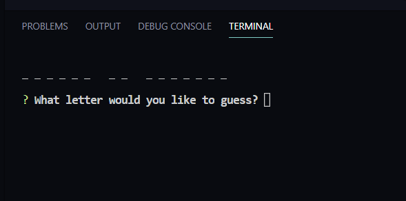
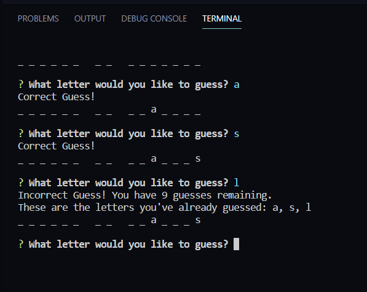
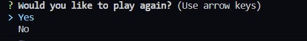

# Game of Thrones WordGuess

This is a word guess game based on the HBO series "Game of Thrones."  Only those that have familiarity with characters and key issues within the show will be successful in completing the game within the 10 guesses.  Do you have what it takes?

## How to Play

There are 15 different words or phrases that are selected random at the start of the game.  The player can choose any of the 26 letters of the alphabet to try and solve the puzzle correctly.  Each time a letter is selected, the chart is updated either with the letter or notated how many remaining incorrect options are left (starting with 10).

Once the game is solve, the player has the option to play again by indicating with the curser either Yes or No.

## Directions

1. run: npm install for packages
2. run: node index.js
3. play the game!

   
   
 

This was a cool way to select if you want to play again rather than the traditional Y or N.  Thank you GitHub community!

### Acknowledgement
Super helpful sites on google and github on understanding how to generate different puzzles and to streamline game.  Too many sites to acknowledge - and i'm appreciative on how well the readme/documentation files were done. 
